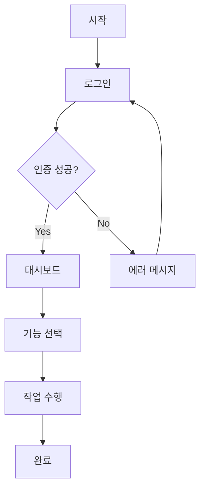

# UX Expert Agent Output Template

**버전:** 1.0.0
**생성일:** 2025-10-29
**목적:** UX Expert 에이전트의 산출물 형식 및 구조 정의

---

## 산출물 개요

UX Expert 에이전트는 **UX Design 문서**를 주요 산출물로 생성한다.

### 파일 정보
- **파일명**: `ux-design.md`
- **경로**: `.claude/outputs/{project-id}-{YYYYMMDD}/ux-design.md`
- **예시**: `.claude/outputs/PROJ-001-20250129/ux-design.md`
- **티켓**: PROJ-003
- **목적**: 사용자 흐름, 화면 구성, 인터랙션, 접근성 설계

---

## UX Design 문서 템플릿

```markdown
# UX Design Document

**프로젝트명**: [프로젝트 이름]
**버전**: 1.0.0
**작성일**: YYYY-MM-DD
**작성자**: UX Expert Agent
**프로젝트 ID**: [project-id]-[YYYYMMDD]
**티켓**: PROJ-003

---

## 1. 개요

### 1.1 문서 목적
이 문서는 [프로젝트명]의 사용자 경험(UX) 및 인터랙션 설계를 정의한다.

### 1.2 참조 문서
- **PRD**: `.claude/outputs/[project-id]-[YYYYMMDD]/prd.md`
- **Architecture**: `.claude/outputs/[project-id]-[YYYYMMDD]/architecture.md` (선택)

### 1.3 UX 설계 원칙
[이 프로젝트의 UX 특화 원칙 - PRD의 일반 원칙과 중복 금지]
- [예: 3클릭 이내 목표 도달]
- [예: 즉각적 피드백 제공]
- [예: 직관적 인터랙션]
- [예: 접근성 우선]

### 1.4 PRD 요약
**타겟 사용자**: [PRD에서 정의된 사용자 - 참조만, 중복 작성 금지]
**주요 기능**: [PRD에서 정의된 핵심 기능 - 참조만]
**제약사항**: [PRD에서 정의된 제약사항 중 UX에 영향을 미치는 것만]

---

## 2. 사용자 흐름 설계

**참고**: PRD에 정의된 사용자 시나리오를 기반으로 구체적인 UX 플로우를 설계한다.

### 2.1 전체 사용자 플로우

```
[Mermaid 다이어그램 또는 텍스트 플로우차트]

예시:
시작
  ↓
로그인 페이지
  ↓
(인증됨?) → No → 에러 메시지 표시 → 로그인 페이지
  ↓ Yes
대시보드
  ↓
[주요 기능] 선택
  ↓
[기능] 페이지
  ↓
작업 완료
  ↓
성공 피드백
  ↓
종료
```

### 2.2 페이지별 플로우

#### 2.2.1 [페이지명] 플로우
**진입점**:
- [진입 경로 1]
- [진입 경로 2]

**주요 액션**:
- [액션 1]: [결과]
- [액션 2]: [결과]

**이탈점**:
- [이탈 경로 1]
- [이탈 경로 2]

### 2.3 내비게이션 패턴

#### 2.3.1 주 내비게이션
**유형**: [예: Top Navigation Bar / Sidebar / Hamburger Menu]
**구성**:
- [메뉴 1]: [목적지]
- [메뉴 2]: [목적지]
- [메뉴 3]: [목적지]

**동작**:
- 현재 페이지 강조 표시
- 호버 시 [반응]
- 모바일: [모바일 동작]

#### 2.3.2 브레드크럼 (Breadcrumb)
**사용 여부**: [Yes/No]
**형식**: [예: Home > Category > Current Page]
**동작**: 각 단계 클릭 시 해당 페이지로 이동

#### 2.3.3 뒤로가기 동작
- 브라우저 뒤로가기: [동작 설명]
- 인앱 뒤로가기 버튼: [동작 설명]
- 상태 보존 여부: [Yes/No, 보존 범위]

---

## 3. 화면 구성 설계

**참고**: PRD에 정의된 기능 목록을 기반으로 화면을 구성한다.

### 3.1 페이지 목록

| 페이지명 | 경로 | 주요 목적 | 중요도 |
|---------|------|----------|--------|
| [홈 페이지] | `/` | [목적] | High |
| [기능 페이지] | `/[feature]` | [목적] | High/Medium/Low |

### 3.2 페이지별 화면 구성

#### 3.2.1 [페이지명]

**레이아웃 구조**:
```
┌─────────────────────────────────┐
│          Header                 │
├─────────────────────────────────┤
│  Nav  │    Main Content         │
│       │                         │
│       │  [주요 컨텐츠 영역]      │
│       │                         │
│       │  [CTA 버튼]             │
├─────────────────────────────────┤
│          Footer                 │
└─────────────────────────────────┘
```

**주요 영역**:

1. **Header**
   - 로고
   - 주 내비게이션
   - 사용자 프로필/로그인 버튼

2. **Main Content**
   - [컨텐츠 섹션 1]: [설명]
   - [컨텐츠 섹션 2]: [설명]
   - [컨텐츠 섹션 3]: [설명]

3. **Footer**
   - [푸터 내용]

**컨텐츠 우선순위**:
1. [최우선 컨텐츠]
2. [중요 컨텐츠]
3. [보조 컨텐츠]

**반응형 고려사항**:
- **Desktop (>1024px)**: [레이아웃 설명]
- **Tablet (768-1024px)**: [레이아웃 변경사항]
- **Mobile (<768px)**: [레이아웃 변경사항]

---

## 4. 인터랙션 설계

### 4.1 사용자 액션 정의

#### 4.1.1 주요 액션

| 액션 | 트리거 | 결과 | 피드백 |
|-----|--------|------|--------|
| [액션명] | [버튼 클릭/입력 등] | [결과 설명] | [피드백 형태] |

#### 4.1.2 보조 액션
[위와 동일한 형식]

### 4.2 피드백 패턴

#### 4.2.1 로딩 상태
**사용 시점**: API 요청, 데이터 로딩
**표시 방법**:
- **짧은 로딩 (< 1초)**: 인라인 스피너
- **중간 로딩 (1-3초)**: 전체 화면 스피너 + 메시지
- **긴 로딩 (> 3초)**: Skeleton UI + 진행률 표시

**메시지 예시**:
- "데이터를 불러오는 중입니다..."
- "처리 중입니다. 잠시만 기다려주세요."

#### 4.2.2 성공 피드백
**사용 시점**: 작업 완료, 저장 성공
**표시 방법**:
- Toast 메시지 (우측 상단, 3초 자동 닫힘)
- 성공 아이콘 + 메시지

**메시지 예시**:
- "저장되었습니다."
- "등록이 완료되었습니다."

#### 4.2.3 에러 피드백
**사용 시점**: 입력 오류, API 에러
**표시 방법**:
- **폼 검증 에러**: 인라인 에러 (입력 필드 하단, 빨간색)
- **시스템 에러**: 전체 화면 에러 모달
- **네트워크 에러**: Toast 메시지 + 재시도 버튼

**메시지 예시**:
- "필수 항목입니다."
- "이메일 형식이 올바르지 않습니다."
- "네트워크 오류가 발생했습니다. 다시 시도해주세요."

#### 4.2.4 확인 (Confirmation)
**사용 시점**: 삭제, 취소 등 되돌릴 수 없는 작업
**표시 방법**: 모달 다이얼로그
**구성**:
- 제목: "[작업명] 하시겠습니까?"
- 설명: "[작업 결과 설명]"
- 버튼: "취소" (보조 버튼), "확인" (주 버튼, 강조)

### 4.3 상태 전환

#### 4.3.1 모달 (Modal)
**트리거**: [버튼 클릭 등]
**열림 애니메이션**: Fade in + Scale up (0.3초)
**닫힘 조건**:
- 닫기 버튼 클릭
- 배경 (Backdrop) 클릭
- ESC 키 누름

**닫힘 애니메이션**: Fade out + Scale down (0.3초)

#### 4.3.2 드로어 (Drawer)
**트리거**: [햄버거 메뉴 클릭 등]
**열림 애니메이션**: Slide in from [left/right] (0.3초)
**닫힘 조건**:
- 닫기 버튼 클릭
- 배경 클릭
- 메뉴 아이템 선택 시 자동 닫힘

**닫힘 애니메이션**: Slide out (0.3초)

#### 4.3.3 탭 (Tabs)
**트리거**: 탭 클릭
**전환 애니메이션**: Fade in (0.2초)
**선택 표시**: 하단 보더 또는 배경색 변경
**URL 동기화**: [Yes/No]

#### 4.3.4 아코디언 (Accordion)
**트리거**: 헤더 클릭
**열림 애니메이션**: Expand (0.3초)
**닫힘 애니메이션**: Collapse (0.3초)
**다중 열림**: [허용/단일만 허용]

### 4.4 폼 인터랙션

#### 4.4.1 입력 필드 상태
**상태 종류**:
- **기본 (Default)**: 회색 보더
- **포커스 (Focus)**: 파란색 보더 + 그림자
- **입력 완료 (Filled)**: 회색 보더 유지
- **에러 (Error)**: 빨간색 보더 + 에러 메시지
- **비활성 (Disabled)**: 회색 배경 + 커서 금지

#### 4.4.2 실시간 검증
**검증 시점**: 입력 필드 blur 또는 submit 시
**에러 표시**: 입력 필드 하단에 즉시 표시
**성공 표시**: 선택 사항 (체크 아이콘 등)

#### 4.4.3 폼 제출
**제출 전**: 모든 필수 필드 검증
**제출 중**: 버튼 비활성 + 로딩 표시
**제출 후**:
- 성공: 성공 메시지 + 다음 페이지로 이동 또는 폼 초기화
- 실패: 에러 메시지 + 폼 유지

### 4.5 마이크로 인터랙션

| 요소 | 인터랙션 | 효과 |
|-----|---------|------|
| 버튼 | Hover | 배경색 변경 + 커서 포인터 |
| 버튼 | Active (클릭) | Scale down (0.95) |
| 링크 | Hover | 밑줄 표시 + 색상 변경 |
| 카드 | Hover | 그림자 증가 + 약간 상승 |
| 아이콘 버튼 | Hover | 배경 원형 표시 |

---

## 5. 접근성 (A11y)

### 5.1 키보드 네비게이션

**Tab 순서**: 논리적 흐름에 따라 포커스 이동
**주요 단축키**:
- `Tab`: 다음 요소로 이동
- `Shift + Tab`: 이전 요소로 이동
- `Enter`: 버튼/링크 활성화
- `Space`: 체크박스/라디오 버튼 토글
- `Esc`: 모달/드로어 닫기
- `Arrow Keys`: 리스트/메뉴 내 이동

**포커스 표시**: 파란색 아웃라인 (outline: 2px solid blue)

### 5.2 스크린 리더 지원

**ARIA 레이블**:
- 모든 버튼: `aria-label` 또는 명확한 텍스트
- 아이콘 버튼: `aria-label="[설명]"`
- 폼 필드: `<label>` 연결 또는 `aria-label`
- 로딩 상태: `aria-live="polite"`
- 에러 메시지: `aria-live="assertive"`

**랜드마크 (Landmarks)**:
- `<header>`: 페이지 헤더
- `<nav>`: 내비게이션
- `<main>`: 주요 컨텐츠
- `<footer>`: 페이지 푸터

**이미지 대체 텍스트**:
- 의미 있는 이미지: `alt="[이미지 설명]"`
- 장식 이미지: `alt=""` (빈 문자열)

### 5.3 색상 대비

**WCAG AA 기준 준수**:
- 일반 텍스트: 최소 4.5:1
- 큰 텍스트 (18pt+): 최소 3:1
- UI 요소: 최소 3:1

**색상만 의존 금지**:
- 에러: 빨간색 + 아이콘 + 텍스트 메시지
- 성공: 초록색 + 아이콘 + 텍스트 메시지

### 5.4 반응형 텍스트

**폰트 크기**:
- 최소 16px (본문 텍스트)
- 제목: 24px 이상
- 모바일: 최소 14px

**줄 간격**: 최소 1.5 (line-height: 1.5)
**단락 간격**: 최소 2em

---

## 6. 사용성 가이드라인

### 6.1 일관성

**UI 패턴 일관성**:
- 버튼 스타일 전체 앱에서 동일
- 에러 메시지 표시 위치 일관
- 내비게이션 구조 일관

**용어 일관성**:
- "저장" vs "등록" → 하나로 통일
- "취소" vs "닫기" → 맥락에 맞게 일관되게 사용

### 6.2 피드백

**즉각적 피드백**:
- 클릭 시 즉시 반응 (0.1초 이내)
- 로딩이 필요한 경우 로딩 표시

**명확한 피드백**:
- 성공/실패 명확히 구분
- 다음 단계 안내

### 6.3 오류 방지

**입력 제약**:
- 숫자만 입력: `type="number"` 또는 패턴 검증
- 이메일: `type="email"` + 형식 검증
- 날짜: Date Picker 사용

**확인 절차**:
- 삭제 등 되돌릴 수 없는 작업: 확인 모달
- 긴 폼: 자동 저장 (Draft)

**도움말**:
- Placeholder: 입력 예시 제공
- Tooltip: 복잡한 필드에 설명 제공

### 6.4 학습 용이성

**온보딩**:
- 첫 방문 사용자: [온보딩 플로우 설명]
- 툴팁, 가이드 제공 여부

**도움말 접근성**:
- FAQ 링크
- 문의하기 버튼 위치

---

## 7. 에러 핸들링 UX

### 7.1 에러 유형별 처리

#### 7.1.1 입력 검증 에러
**표시 위치**: 입력 필드 하단
**표시 시점**: blur 또는 submit 시
**스타일**: 빨간색 텍스트 + 빨간색 보더
**복구 방법**: 사용자가 수정 입력

#### 7.1.2 네트워크 에러
**표시 위치**: Toast 메시지 또는 인라인
**메시지**: "네트워크 연결을 확인해주세요."
**복구 방법**: "재시도" 버튼 제공

#### 7.1.3 권한 에러
**표시 위치**: 전체 화면 또는 모달
**메시지**: "접근 권한이 없습니다."
**복구 방법**: 로그인 페이지로 이동 또는 이전 페이지로 돌아가기

#### 7.1.4 시스템 에러 (500)
**표시 위치**: 전체 화면 에러 페이지
**메시지**: "일시적인 오류가 발생했습니다. 잠시 후 다시 시도해주세요."
**복구 방법**: 홈으로 이동 버튼

#### 7.1.5 404 에러
**표시 위치**: 전체 화면 에러 페이지
**메시지**: "페이지를 찾을 수 없습니다."
**복구 방법**: 홈으로 이동 버튼 + 검색 기능 제공

### 7.2 에러 메시지 작성 원칙

1. **명확성**: 무엇이 잘못되었는지 명확히 설명
2. **구체성**: "오류가 발생했습니다" 보다 "이메일 형식이 올바르지 않습니다"
3. **해결 방법 제시**: "다시 시도해주세요", "관리자에게 문의하세요"
4. **공손한 어조**: "~해주세요", "~해 주시겠어요?"

---

## 8. 플랫폼별 고려사항

### 8.1 데스크톱 (Desktop)

**화면 크기**: 1024px 이상
**인터랙션**: 마우스 + 키보드
**레이아웃**: 다단 레이아웃 가능
**호버 상태**: 활성화

### 8.2 태블릿 (Tablet)

**화면 크기**: 768px - 1024px
**인터랙션**: 터치 우선
**레이아웃**: 단순화된 레이아웃
**버튼 크기**: 최소 44px × 44px (터치 타겟)

### 8.3 모바일 (Mobile)

**화면 크기**: 768px 미만
**인터랙션**: 터치만
**레이아웃**: 단일 컬럼
**버튼 크기**: 최소 48px × 48px
**스크롤**: 세로 스크롤 우선
**제스처**:
- Swipe: [사용 여부 및 용도]
- Pinch to zoom: [사용 여부]
- Pull to refresh: [사용 여부]

---

## 9. 성능 고려사항 (UX 관점)

### 9.1 체감 성능 개선

**Skeleton UI**: 데이터 로딩 중 레이아웃 미리 표시
**Progressive Loading**: 중요한 컨텐츠 우선 로드
**Lazy Loading**: 스크롤 시 이미지/컨텐츠 로드

### 9.2 로딩 시간 기대치

- **< 1초**: 즉각적으로 느껴짐, 별도 로딩 표시 불필요
- **1-3초**: 로딩 표시 필요 (스피너)
- **> 3초**: 진행률 표시 또는 Skeleton UI 필요

### 9.3 오프라인 대응

**오프라인 감지**: 네트워크 끊김 시 알림 표시
**캐시 활용**: 이전 데이터 표시 + "오프라인입니다" 메시지
**재연결 감지**: 자동으로 데이터 새로고침

---

## 10. 다이어그램 및 와이어프레임

### 10.1 주요 화면 와이어프레임

#### 10.1.1 [화면명] 와이어프레임

```
[ASCII 또는 Mermaid 다이어그램으로 화면 구조 표현]

┌────────────────────────────────────┐
│  Logo    Nav1  Nav2  Nav3  Profile │
├────────────────────────────────────┤
│                                    │
│  [Hero Section]                    │
│                                    │
├────────────────────────────────────┤
│  [컨텐츠 영역 1]                    │
│                                    │
├────────────────────────────────────┤
│  [CTA 버튼]                         │
└────────────────────────────────────┘
```

### 10.2 사용자 플로우 다이어그램



---

## 11. 변경 이력

| 버전 | 날짜 | 작성자 | 변경 내용 |
|------|------|--------|-----------|
| 1.0.0 | YYYY-MM-DD | UX Expert | 초안 작성 |

---

**다음 단계**: Product Owner에게 전달 (Architecture와 함께)
```

---

## 출력 위치 및 파일 관리

### 파일 경로
- **UX Design 문서**: `.claude/outputs/{project-id}-{YYYYMMDD}/ux-design.md`
- **예시**: `.claude/outputs/PROJ-001-20250129/ux-design.md`

### 다이어그램 포함 권장사항
- ASCII 아트 또는 Mermaid 다이어그램 사용
- 사용자 플로우차트, 와이어프레임, 인터랙션 다이어그램 포함
- 복잡한 다이어그램은 별도 이미지 파일로 관리 가능

---

**이 템플릿은 UX Expert 에이전트가 산출물을 생성할 때 반드시 따라야 하는 표준 형식이다.**
