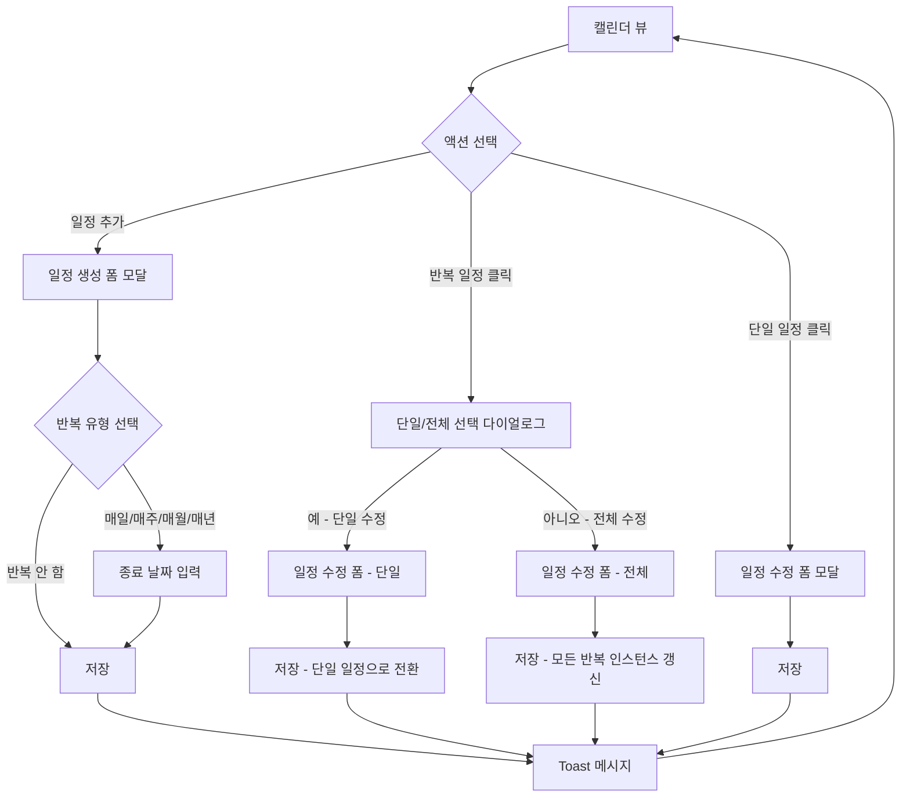

# UX Design Document

**프로젝트명**: 캘린더 반복 일정 기능
**버전**: 1.0.0
**작성일**: 2025-01-29
**작성자**: UX Expert Agent
**프로젝트 ID**: PROJ-001-20250129
**티켓**: PROJ-003

---

## 1. 개요

### 1.1 문서 목적
이 문서는 캘린더 반복 일정 기능의 사용자 경험(UX) 및 인터랙션 설계를 정의한다.

### 1.2 참조 문서
- **PRD**: `.claude/outputs/PROJ-001-20250129/prd.md`
- **Architecture**: `.claude/outputs/PROJ-001-20250129/architecture.md`

### 1.3 UX 설계 원칙
- **직관적 구분**: 반복 일정과 단일 일정을 시각적으로 명확히 구분
- **명확한 선택**: 단일/전체 수정·삭제 선택 시 결과를 사용자가 즉시 이해 가능
- **즉각적 피드백**: 일정 생성/수정/삭제 시 즉각적인 시각적 피드백 제공
- **접근성 우선**: 키보드 네비게이션 및 스크린 리더 완벽 지원
- **실수 방지**: 되돌릴 수 없는 작업(전체 삭제 등)에 명확한 확인 절차 제공

### 1.4 PRD 요약
**타겟 사용자**: PRD 섹션 4.1 참조 (일반 사용자, 직장인, 학생, 개인 관리 중심 사용자)
**주요 기능**: PRD 섹션 3 참조 (반복 유형 선택, 반복 표시, 종료 조건, 단일/전체 수정, 단일/전체 삭제)
**제약사항**:
- 반복 종료일 최대 2025-12-31
- 4가지 반복 유형만 지원 (매일, 매주, 매월, 매년)
- 31일/윤년 2월 29일 특수 처리 필요

---

## 2. 사용자 흐름 설계

### 2.1 전체 사용자 플로우

```
시작 (캘린더 뷰)
  ↓
[일정 생성 버튼 클릭]
  ↓
일정 생성 폼 모달
  ↓
제목, 날짜, 시간 입력
  ↓
[반복 여부 선택]
  ├─ "반복 안 함" → 저장 → 단일 일정 생성 → 캘린더 뷰
  └─ "매일/매주/매월/매년" 선택
      ↓
    종료 날짜 입력 (기본: 2025-12-31)
      ↓
    저장 → 반복 일정 생성 → 캘린더 뷰 (반복 아이콘 표시)
```

### 2.2 페이지별 플로우

#### 2.2.1 캘린더 뷰 플로우

**진입점**:
- 앱 초기 진입 (기본 페이지)
- 내비게이션 메뉴에서 "캘린더" 클릭

**주요 액션**:
- **월 이동**: 이전/다음 월 버튼 클릭 → 해당 월 캘린더 렌더링
- **일정 클릭**: 일반 일정 클릭 → 일정 수정 모달 / 반복 일정 클릭 → 단일/전체 선택 다이얼로그
- **일정 생성**: "+" 버튼 클릭 → 일정 생성 폼 모달

**이탈점**:
- 다른 페이지로 내비게이션

#### 2.2.2 일정 생성/수정 플로우

```
일정 폼 모달 열림
  ↓
필수 필드 입력 (제목, 시작일, 종료일)
  ↓
[반복 유형 선택]
  ↓ (반복 선택 시)
종료 조건 입력 필드 활성화
  ↓
종료 날짜 입력 (Date Picker)
  ↓
[저장 버튼 클릭]
  ↓
입력 검증
  ├─ 실패 → 인라인 에러 표시 → 수정 대기
  └─ 성공 → 로딩 표시 → 저장 완료 → Toast 메시지 → 모달 닫힘 → 캘린더 갱신
```

#### 2.2.3 반복 일정 수정 플로우

```
반복 일정 클릭
  ↓
확인 다이얼로그 표시
"해당 일정만 수정하시겠어요?"
  ├─ "예" (단일 수정)
  │   ↓
  │ 일정 수정 폼 모달 (해당 날짜만)
  │   ↓
  │ 수정 후 저장
  │   ↓
  │ 단일 일정으로 전환 (반복 아이콘 제거)
  │
  └─ "아니오" (전체 수정)
      ↓
    일정 수정 폼 모달 (전체 반복 일정)
      ↓
    수정 후 저장
      ↓
    모든 반복 인스턴스 갱신 (반복 아이콘 유지)
```

#### 2.2.4 반복 일정 삭제 플로우

```
반복 일정의 삭제 버튼 클릭
  ↓
확인 다이얼로그 표시
"해당 일정만 삭제하시겠어요?"
  ├─ "예" (단일 삭제)
  │   ↓
  │ 선택한 날짜의 일정만 삭제
  │   ↓
  │ 캘린더 갱신 (해당 날짜만 일정 제거)
  │
  └─ "아니오" (전체 삭제)
      ↓
    추가 확인 다이얼로그 표시 (선택사항)
    "모든 반복 일정을 삭제하시겠습니까?"
      ├─ "취소" → 이전 화면
      └─ "삭제"
          ↓
        모든 반복 인스턴스 삭제
          ↓
        캘린더 갱신 (모든 반복 일정 제거)
```

### 2.3 내비게이션 패턴

#### 2.3.1 주 내비게이션
**유형**: Top Navigation Bar
**구성**:
- 로고: 좌측 상단
- 캘린더: 주 메뉴
- (향후 확장: 일정 목록, 설정 등)

**동작**:
- 현재 페이지 강조 표시 (하단 보더 또는 배경색)
- 호버 시 배경색 변경
- 모바일: 햄버거 메뉴로 전환

#### 2.3.2 월 네비게이션
**위치**: 캘린더 상단 중앙
**구성**:
- 좌측 화살표: 이전 월로 이동
- 중앙 텍스트: "YYYY년 MM월" 표시
- 우측 화살표: 다음 월로 이동

**동작**:
- 화살표 클릭 시 부드러운 전환 애니메이션 (Fade in)
- 키보드: 좌/우 화살표 키로도 월 이동 가능

---

## 3. 화면 구성 설계

### 3.1 페이지 목록

| 페이지명 | 경로 | 주요 목적 | 중요도 |
|---------|------|----------|--------|
| 캘린더 페이지 | `/` | 월별 캘린더 뷰 및 일정 관리 | High |

### 3.2 페이지별 화면 구성

#### 3.2.1 캘린더 페이지

**레이아웃 구조**:
```
┌─────────────────────────────────────────────┐
│  Logo         Calendar          [+ 일정]    │
├─────────────────────────────────────────────┤
│                                             │
│   ←    2025년 1월    →                      │
│                                             │
│  ┌─────────────────────────────────────┐   │
│  │  일  월  화  수  목  금  토          │   │
│  ├─────────────────────────────────────┤   │
│  │  29  30  31   1   2   3   4         │   │
│  │   5   6   7   8   9  10  11         │   │
│  │  [일정 카드 🔄]  [일정 카드]        │   │
│  │  12  13  14  15  16  17  18         │   │
│  │  ...                                │   │
│  └─────────────────────────────────────┘   │
│                                             │
└─────────────────────────────────────────────┘
```

**주요 영역**:

1. **Header**
   - 로고 (좌측)
   - 내비게이션 메뉴 (중앙)
   - "일정 추가" 버튼 (우측, 강조 스타일)

2. **Month Navigation**
   - 이전 월 버튼 (←)
   - 현재 월 표시 ("YYYY년 MM월")
   - 다음 월 버튼 (→)

3. **Calendar Grid**
   - 요일 헤더 (일~토)
   - 날짜 셀 (7×6 그리드)
   - 일정 카드 (각 날짜 내 최대 3개 표시, 이상 시 "+N개" 표시)

4. **Event Card**
   - 일정 제목 (truncate)
   - 반복 일정 아이콘 (🔄, 우측 상단)
   - 배경색: 카테고리별 또는 기본 색상

**컨텐츠 우선순위**:
1. 현재 월의 일정 (가장 중요)
2. 월 네비게이션
3. 일정 추가 버튼

**반응형 고려사항**:
- **Desktop (>1024px)**: 전체 월 그리드 표시
- **Tablet (768-1024px)**: 전체 월 그리드 표시, 일정 카드 크기 축소
- **Mobile (<768px)**:
  - 주간 뷰로 전환 (1주일씩 표시)
  - 일정 카드를 탭하면 상세 보기
  - "일정 추가" 버튼을 플로팅 액션 버튼(FAB)으로 변경

#### 3.2.2 일정 생성/수정 폼 모달

**레이아웃 구조**:
```
┌─────────────────────────────────────┐
│  일정 추가                    [×]   │
├─────────────────────────────────────┤
│                                     │
│  제목 *                             │
│  ┌───────────────────────────────┐ │
│  │                               │ │
│  └───────────────────────────────┘ │
│                                     │
│  시작일 *       종료일 *            │
│  [📅 2025-01-29]  [📅 2025-01-29]  │
│                                     │
│  반복 유형                          │
│  ┌───────────────────────────────┐ │
│  │ 반복 안 함  ▼                 │ │
│  └───────────────────────────────┘ │
│                                     │
│  └─ (반복 선택 시) 종료 날짜       │
│      [📅 2025-12-31]               │
│                                     │
│  [취소]              [저장]        │
└─────────────────────────────────────┘
```

**주요 영역**:
1. **제목 필드**: 텍스트 입력, 필수
2. **날짜 필드**: Date Picker, 필수
3. **반복 유형 선택**: 드롭다운 (반복 안 함, 매일, 매주, 매월, 매년)
4. **종료 날짜 필드**: Date Picker, 반복 선택 시에만 표시 (조건부 렌더링)
5. **액션 버튼**: 취소 (보조), 저장 (주 버튼)

**인터랙션**:
- 반복 유형 선택 시 종료 날짜 필드가 Slide Down 애니메이션으로 나타남
- 저장 버튼 클릭 시 검증 실패 시 해당 필드 하단에 빨간색 에러 메시지 표시

---

## 4. 인터랙션 설계

### 4.1 사용자 액션 정의

#### 4.1.1 주요 액션

| 액션 | 트리거 | 결과 | 피드백 |
|-----|--------|------|--------|
| 일정 생성 | "+ 일정" 버튼 클릭 | 일정 생성 모달 열림 | 모달 Fade in + Scale up (0.3초) |
| 월 이동 | 좌/우 화살표 클릭 | 해당 월 캘린더 렌더링 | Fade in 전환 (0.2초) |
| 반복 일정 클릭 | 반복 일정 카드 클릭 | 단일/전체 선택 다이얼로그 표시 | 다이얼로그 Fade in (0.2초) |
| 일정 저장 | "저장" 버튼 클릭 | 일정 생성/수정 후 모달 닫힘 | 로딩 표시 → Toast 메시지 (3초) |
| 일정 삭제 | "삭제" 버튼 클릭 | 확인 다이얼로그 표시 | 다이얼로그 Fade in (0.2초) |

#### 4.1.2 보조 액션

| 액션 | 트리거 | 결과 | 피드백 |
|-----|--------|------|--------|
| 반복 유형 변경 | 드롭다운 선택 | 종료 날짜 필드 표시/숨김 | Slide down/up (0.2초) |
| 날짜 선택 | Date Picker 클릭 | 달력 팝업 표시 | 팝업 Fade in (0.2초) |
| 모달 닫기 | 배경 또는 ESC 키 | 모달 닫힘 | Fade out (0.2초) |

### 4.2 피드백 패턴

#### 4.2.1 로딩 상태
**사용 시점**: 일정 저장, 삭제, 월 데이터 로딩
**표시 방법**:
- **짧은 로딩 (< 1초)**: 버튼 내 인라인 스피너 (저장/삭제 중)
- **중간 로딩 (1-3초)**: 전체 화면 스피너 + "처리 중입니다..." 메시지
- **긴 로딩 (> 3초)**: Skeleton UI (캘린더 그리드 형태)

**메시지 예시**:
- "일정을 저장하는 중입니다..."
- "일정을 삭제하는 중입니다..."

#### 4.2.2 성공 피드백
**사용 시점**: 일정 생성/수정/삭제 완료
**표시 방법**:
- Toast 메시지 (우측 상단, 3초 자동 닫힘)
- 초록색 배경 + 체크 아이콘

**메시지 예시**:
- "일정이 생성되었습니다."
- "일정이 수정되었습니다."
- "일정이 삭제되었습니다."

#### 4.2.3 에러 피드백
**사용 시점**: 입력 오류, API 에러
**표시 방법**:
- **폼 검증 에러**: 입력 필드 하단, 빨간색 텍스트
- **시스템 에러**: 모달 다이얼로그
- **네트워크 에러**: Toast 메시지 + "재시도" 버튼

**메시지 예시**:
- "제목을 입력해주세요." (필수 필드)
- "종료 날짜는 시작 날짜보다 이후여야 합니다." (검증 에러)
- "네트워크 오류가 발생했습니다. 다시 시도해주세요." (네트워크 에러)

#### 4.2.4 확인 (Confirmation)
**사용 시점**:
- 반복 일정 수정 (단일/전체 선택)
- 반복 일정 삭제 (단일/전체 선택)

**표시 방법**: 모달 다이얼로그 (중앙)
**구성**:
- **수정 확인**:
  - 제목: "일정 수정"
  - 설명: "해당 일정만 수정하시겠어요?"
  - 버튼: "예" (주 버튼), "아니오" (보조 버튼)
- **삭제 확인**:
  - 제목: "일정 삭제"
  - 설명: "해당 일정만 삭제하시겠어요?"
  - 버튼: "예" (주 버튼), "아니오" (보조 버튼)

**스타일**:
- 다이얼로그 크기: 최대 400px 너비
- 배경: 반투명 검정 (backdrop-blur)
- 버튼 간격: 12px

### 4.3 상태 전환

#### 4.3.1 모달 (Modal)
**트리거**:
- "일정 추가" 버튼 클릭
- 일정 카드 클릭 (수정)

**열림 애니메이션**: Fade in + Scale up (0.3초)
**닫힘 조건**:
- "취소" 버튼 클릭
- 배경 (Backdrop) 클릭
- ESC 키 누름
- "저장" 성공 후

**닫힘 애니메이션**: Fade out + Scale down (0.3초)

#### 4.3.2 드롭다운 (Dropdown)
**트리거**: 반복 유형 필드 클릭
**열림 애니메이션**: Slide down (0.2초)
**닫힘 조건**:
- 옵션 선택
- 외부 영역 클릭
- ESC 키

**닫힘 애니메이션**: Slide up (0.2초)

#### 4.3.3 Date Picker
**트리거**: 날짜 필드 클릭
**열림 애니메이션**: Fade in (0.2초)
**닫힘 조건**:
- 날짜 선택
- 외부 영역 클릭
- ESC 키

**닫힘 애니메이션**: Fade out (0.2초)

#### 4.3.4 조건부 필드 (종료 날짜)
**트리거**: 반복 유형 선택
**표시 애니메이션**:
- 반복 선택 시: Slide down + Fade in (0.2초)
- 반복 안 함 선택 시: Slide up + Fade out (0.2초)

### 4.4 폼 인터랙션

#### 4.4.1 입력 필드 상태
**상태 종류**:
- **기본 (Default)**: 회색 보더 (`border-gray-300`)
- **포커스 (Focus)**: 파란색 보더 + 그림자 (`border-blue-500, shadow-outline`)
- **입력 완료 (Filled)**: 회색 보더 유지
- **에러 (Error)**: 빨간색 보더 + 에러 메시지 (`border-red-500`)
- **비활성 (Disabled)**: 회색 배경 + 커서 금지 (`bg-gray-100, cursor-not-allowed`)

#### 4.4.2 실시간 검증
**검증 시점**:
- 입력 필드 blur 시
- "저장" 버튼 클릭 시

**에러 표시**: 입력 필드 하단에 즉시 표시 (빨간색 텍스트, 작은 폰트)

**검증 규칙**:
- 제목: 필수 입력
- 시작일/종료일: 필수 입력, 종료일 ≥ 시작일
- 반복 종료일: 시작일보다 이후, 최대 2025-12-31

#### 4.4.3 폼 제출
**제출 전**: 모든 필수 필드 검증
**제출 중**:
- "저장" 버튼 비활성 + 로딩 스피너
- 배경 클릭 금지

**제출 후**:
- **성공**: Toast 메시지 + 모달 닫힘 + 캘린더 갱신
- **실패**: 에러 메시지 표시 + 폼 유지

### 4.5 마이크로 인터랙션

| 요소 | 인터랙션 | 효과 |
|-----|---------|------|
| 버튼 | Hover | 배경색 어둡게 (`hover:bg-blue-600`) + 커서 포인터 |
| 버튼 | Active (클릭) | Scale down (0.95) + 약간 어둡게 |
| 일정 카드 | Hover | 그림자 증가 + 약간 상승 (`hover:shadow-lg, transform: translateY(-2px)`) |
| 월 이동 버튼 | Hover | 배경 원형 표시 (회색) |
| 반복 아이콘 | 상시 표시 | 순환 화살표 아이콘 (🔄), 회색 또는 파란색 |
| Date Picker | 날짜 선택 시 | 선택된 날짜 배경색 변경 (파란색) |

---

## 5. 접근성 (A11y)

### 5.1 키보드 네비게이션

**Tab 순서**:
1. 헤더 내비게이션
2. "일정 추가" 버튼
3. 월 이동 버튼 (좌)
4. 월 이동 버튼 (우)
5. 캘린더 그리드 (날짜 셀)
6. 일정 카드

**주요 단축키**:
- `Tab`: 다음 요소로 이동
- `Shift + Tab`: 이전 요소로 이동
- `Enter`: 버튼/링크 활성화, 일정 카드 선택
- `Space`: 체크박스/라디오 버튼 토글 (향후 확장)
- `Esc`: 모달/드롭다운 닫기
- `Arrow Left/Right`: 월 이동 (캘린더 뷰에서)
- `Arrow Keys`: 날짜 셀 간 이동 (캘린더 그리드 내)

**포커스 표시**: 파란색 아웃라인 (`outline: 2px solid #3B82F6, outline-offset: 2px`)

### 5.2 스크린 리더 지원

**ARIA 레이블**:
- 모든 버튼: `aria-label` 제공
  - 월 이동 버튼: `aria-label="이전 월"`, `aria-label="다음 월"`
  - 일정 추가 버튼: `aria-label="일정 추가"`
  - 닫기 버튼: `aria-label="모달 닫기"`
- 반복 아이콘: `aria-label="반복 일정"`, `role="img"`
- 폼 필드: `<label>` 태그로 연결
- 로딩 상태: `aria-live="polite"`, `aria-busy="true"`
- 에러 메시지: `aria-live="assertive"`, `role="alert"`
- Toast 메시지: `aria-live="polite"`, `role="status"`

**랜드마크 (Landmarks)**:
- `<header>`: 페이지 헤더
- `<nav>`: 내비게이션
- `<main>`: 캘린더 메인 컨텐츠
- `<dialog>`: 모달 및 다이얼로그

**캘린더 그리드**:
- `<table>` 또는 `role="grid"` 사용
- 날짜 셀: `role="gridcell"`, `aria-label="2025년 1월 29일"`
- 일정 카드: `role="button"`, `aria-label="[일정 제목], [날짜], 반복 일정"` (반복 일정인 경우)

**이미지 대체 텍스트**:
- 반복 아이콘: `alt="반복 일정"` 또는 `aria-label="반복 일정"`

### 5.3 색상 대비

**WCAG AA 기준 준수**:
- 일반 텍스트: 최소 4.5:1 (검정 텍스트 `#000` vs 흰 배경 `#FFF`)
- 버튼 텍스트: 최소 4.5:1 (흰색 텍스트 `#FFF` vs 파란색 배경 `#3B82F6`)
- UI 요소 (보더, 아이콘): 최소 3:1

**색상만 의존 금지**:
- 에러: 빨간색 보더 + 빨간색 텍스트 + 에러 아이콘 (⚠️)
- 성공: 초록색 배경 + 체크 아이콘 (✓) + "성공" 텍스트
- 반복 일정: 파란색 아이콘 + 텍스트 레이블 (스크린 리더용)

### 5.4 반응형 텍스트

**폰트 크기**:
- 본문 텍스트: 16px (기본)
- 제목 (헤더): 24px
- 일정 제목: 14px
- 에러 메시지: 12px
- 모바일: 최소 14px (본문)

**줄 간격**: 1.5 (`line-height: 1.5`)
**단락 간격**: 최소 1em (`margin-bottom: 1em`)

---

## 6. 사용성 가이드라인

### 6.1 일관성

**UI 패턴 일관성**:
- 주 버튼 (Primary): 파란색 배경, 흰색 텍스트, 둥근 모서리
- 보조 버튼 (Secondary): 회색 보더, 검정 텍스트, 둥근 모서리
- 에러 메시지 위치: 항상 입력 필드 하단
- 모달 위치: 항상 화면 중앙
- Toast 위치: 항상 우측 상단

**용어 일관성**:
- "저장" (일정 생성/수정 시)
- "삭제" (일정 삭제 시)
- "취소" (작업 취소 시)
- "닫기" (모달 닫기 시 - X 버튼)

### 6.2 피드백

**즉각적 피드백**:
- 버튼 클릭 시 즉시 반응 (0.1초 이내)
- 호버 시 즉시 스타일 변경
- 로딩이 필요한 경우 즉시 로딩 표시

**명확한 피드백**:
- 성공/실패 명확히 구분 (색상 + 아이콘 + 텍스트)
- 다음 단계 안내 (예: "일정이 생성되었습니다." → 자동으로 캘린더로 돌아감)

### 6.3 오류 방지

**입력 제약**:
- 날짜: Date Picker 사용 (수동 입력 금지)
- 반복 유형: 드롭다운 사용 (미리 정의된 옵션만)
- 종료 날짜: 최대 2025-12-31까지만 선택 가능 (Date Picker에서 제한)

**확인 절차**:
- 반복 일정 수정/삭제: 단일/전체 선택 다이얼로그
- 전체 삭제 시 추가 확인 (선택사항)

**도움말**:
- Placeholder:
  - 제목: "일정 제목을 입력하세요"
  - 날짜: "날짜 선택"
- Tooltip (향후 확장):
  - 반복 유형 옆 물음표 아이콘: "매월 31일 반복 시, 31일이 없는 달은 건너뜁니다."

### 6.4 학습 용이성

**온보딩** (향후 확장):
- 첫 방문 사용자:
  - 반복 일정 아이콘에 대한 간단한 툴팁
  - "반복 유형 선택 시 종료 날짜를 설정할 수 있습니다" 안내

**도움말 접근성** (향후 확장):
- FAQ 페이지
- "도움말" 버튼 (헤더 우측)

---

## 7. 에러 핸들링 UX

### 7.1 에러 유형별 처리

#### 7.1.1 입력 검증 에러
**표시 위치**: 입력 필드 하단
**표시 시점**: blur 또는 "저장" 버튼 클릭 시
**스타일**: 빨간색 텍스트 (12px) + 빨간색 보더
**복구 방법**: 사용자가 수정 입력

**메시지 예시**:
- "제목을 입력해주세요."
- "종료 날짜는 시작 날짜보다 이후여야 합니다."
- "종료 날짜는 2025-12-31 이전이어야 합니다."

#### 7.1.2 네트워크 에러
**표시 위치**: Toast 메시지 (우측 상단)
**메시지**: "네트워크 연결을 확인해주세요."
**복구 방법**: "재시도" 버튼 제공
**스타일**: 빨간색 배경 + 흰색 텍스트 + 재시도 버튼

#### 7.1.3 시스템 에러 (500)
**표시 위치**: 모달 다이얼로그 (중앙)
**메시지**: "일시적인 오류가 발생했습니다. 잠시 후 다시 시도해주세요."
**복구 방법**: "확인" 버튼 → 모달 닫힘
**스타일**:
- 제목: "오류 발생"
- 본문: 에러 메시지
- 버튼: "확인" (주 버튼)

#### 7.1.4 로컬 스토리지 에러
**표시 위치**: Toast 메시지
**메시지**: "일정을 저장할 수 없습니다. 브라우저 저장소를 확인해주세요."
**복구 방법**: 사용자가 브라우저 설정 확인

### 7.2 에러 메시지 작성 원칙

1. **명확성**: 무엇이 잘못되었는지 명확히 설명
   - ❌ "오류가 발생했습니다."
   - ✅ "종료 날짜는 시작 날짜보다 이후여야 합니다."

2. **구체성**: 구체적인 필드 및 이유 제시
   - ❌ "입력 오류"
   - ✅ "제목을 입력해주세요."

3. **해결 방법 제시**: 사용자가 어떻게 해야 하는지 안내
   - ❌ "실패했습니다."
   - ✅ "네트워크 연결을 확인 후 다시 시도해주세요."

4. **공손한 어조**: 명령형이 아닌 요청형
   - ❌ "입력하시오."
   - ✅ "입력해주세요."

---

## 8. 플랫폼별 고려사항

### 8.1 데스크톱 (Desktop)

**화면 크기**: 1024px 이상
**인터랙션**: 마우스 + 키보드
**레이아웃**: 전체 월 그리드 (7×6)
**호버 상태**: 활성화 (버튼, 일정 카드 등)
**일정 카드**: 각 날짜 셀에 최대 3개 표시, 이상 시 "+N개" 표시

### 8.2 태블릿 (Tablet)

**화면 크기**: 768px - 1024px
**인터랙션**: 터치 우선 (마우스도 지원)
**레이아웃**: 전체 월 그리드 (7×6), 일정 카드 크기 축소
**버튼 크기**: 최소 44px × 44px (터치 타겟)
**호버 상태**: 비활성화 (터치 환경)

### 8.3 모바일 (Mobile)

**화면 크기**: 768px 미만
**인터랙션**: 터치만
**레이아웃**:
- 주간 뷰로 전환 (1주일씩 표시)
- 일정 카드를 탭하면 상세 보기 모달
- 단일 컬럼 레이아웃

**버튼 크기**: 최소 48px × 48px
**스크롤**: 세로 스크롤 우선
**일정 추가 버튼**: 플로팅 액션 버튼(FAB)으로 변경 (우측 하단)
**제스처**:
- Swipe (좌/우): 주간 이동 (향후 확장)
- Pinch to zoom: 비활성화
- Pull to refresh: 비활성화

---

## 9. 성능 고려사항 (UX 관점)

### 9.1 체감 성능 개선

**Skeleton UI**:
- 캘린더 그리드 로딩 시 Skeleton 표시 (회색 박스 형태)
- 일정 카드 로딩 시 Skeleton 카드 표시

**Progressive Loading**:
- 현재 월 데이터 우선 로드
- 이전/다음 월 데이터는 백그라운드에서 로드

**Lazy Loading**:
- 일정 카드 이미지 (향후 확장 시)
- 많은 일정이 있는 경우 스크롤 시 로드

**Optimistic UI**:
- 일정 생성/수정 시 즉시 캘린더에 반영 (낙관적 업데이트)
- API 실패 시 롤백 + 에러 메시지

### 9.2 로딩 시간 기대치

- **< 1초**: 즉각적으로 느껴짐, 별도 로딩 표시 불필요
  - 예: 월 이동, 드롭다운 열기
- **1-3초**: 로딩 표시 필요 (스피너)
  - 예: 일정 저장, 삭제
- **> 3초**: Skeleton UI 또는 진행률 표시 필요
  - 예: 대량 반복 일정 생성 (1000개 이상)

### 9.3 오프라인 대응 (향후 확장)

**오프라인 감지**: 네트워크 끊김 시 Toast 알림 표시
**캐시 활용**: LocalStorage에 저장된 데이터 표시 + "오프라인입니다" 메시지
**재연결 감지**: 자동으로 데이터 동기화 시도

---

## 10. 다이어그램 및 와이어프레임

### 10.1 주요 화면 와이어프레임

#### 10.1.1 캘린더 뷰 와이어프레임 (Desktop)

```
┌───────────────────────────────────────────────────────────┐
│  [Logo]      Calendar                         [+ 일정]    │ Header
├───────────────────────────────────────────────────────────┤
│                                                           │
│              ←      2025년 1월      →                     │ Month Nav
│                                                           │
│  ┌──────────────────────────────────────────────────┐   │
│  │  일   월   화   수   목   금   토                 │   │ Week Header
│  ├──────────────────────────────────────────────────┤   │
│  │ 29   30   31    1    2    3    4                │   │
│  │                                                  │   │
│  │  5    6    7    8    9   10   11                │   │
│  │          ┌──────────────┐                        │   │
│  │          │ 주간 회의 🔄 │ (반복 일정)            │   │ Event Card
│  │          └──────────────┘                        │   │
│  │ 12   13   14   15   16   17   18                │   │
│  │               ┌──────────┐                       │   │
│  │               │ 운동     │ (단일 일정)           │   │
│  │               └──────────┘                       │   │
│  │ 19   20   21   22   23   24   25                │   │
│  │                                                  │   │
│  │ 26   27   28   29   30   31    1                │   │
│  └──────────────────────────────────────────────────┘   │
│                                                           │
└───────────────────────────────────────────────────────────┘
```

#### 10.1.2 일정 생성 모달 와이어프레임

```
                ┌─────────────────────────────┐
                │  일정 추가             [×]  │
                ├─────────────────────────────┤
                │                             │
                │  제목 *                     │
                │  ┌───────────────────────┐ │
                │  │ 주간 회의             │ │
                │  └───────────────────────┘ │
                │                             │
                │  시작일 *     종료일 *      │
                │  ┌─────────┐ ┌─────────┐  │
                │  │📅 01/29 │ │📅 01/29 │  │
                │  └─────────┘ └─────────┘  │
                │                             │
                │  반복 유형                  │
                │  ┌───────────────────────┐ │
                │  │ 매주  ▼               │ │
                │  └───────────────────────┘ │
                │                             │
                │  └─ 종료 날짜               │
                │      ┌───────────────────┐ │
                │      │📅 2025-12-31      │ │
                │      └───────────────────┘ │
                │                             │
                │                             │
                │  [취소]         [저장]     │
                └─────────────────────────────┘
```

#### 10.1.3 단일/전체 선택 다이얼로그

```
            ┌─────────────────────────────────┐
            │  일정 수정                      │
            ├─────────────────────────────────┤
            │                                 │
            │  해당 일정만 수정하시겠어요?    │
            │                                 │
            │  - 예: 이 일정만 수정합니다     │
            │  - 아니오: 모든 반복 일정을     │
            │    수정합니다                   │
            │                                 │
            │                                 │
            │         [예]      [아니오]      │
            └─────────────────────────────────┘
```

### 10.2 사용자 플로우 다이어그램



---

## 11. 특수 케이스 UX 처리

### 11.1 월말 처리 (31일 반복)

**시나리오**: 사용자가 1월 31일에 "매월" 반복 일정을 생성

**UX 처리**:
1. **일정 생성 시**: 별도 경고 없이 생성 허용
2. **캘린더 표시**:
   - 31일이 있는 달: 정상 표시 (1월, 3월, 5월, 7월, 8월, 10월, 12월)
   - 31일이 없는 달: 일정이 표시되지 않음 (2월, 4월, 6월, 9월, 11월)
3. **설명 제공** (향후 확장):
   - 반복 유형 선택 시 툴팁 표시: "31일에 매월 반복하면, 31일이 없는 달은 건너뜁니다."
   - 또는 일정 카드에 마우스 호버 시: "매월 31일 반복 (31일이 없는 달은 제외)"

### 11.2 윤년 처리 (2월 29일 반복)

**시나리오**: 사용자가 2월 29일에 "매년" 반복 일정을 생성 (2024년 윤년 기준)

**UX 처리**:
1. **일정 생성 시**: 별도 경고 없이 생성 허용
2. **캘린더 표시**:
   - 윤년 (2024년): 2월 29일에 일정 표시
   - 평년 (2025년): 2월 29일에 일정 표시 안 함
3. **설명 제공** (향후 확장):
   - 툴팁: "2월 29일에 매년 반복하면, 윤년에만 표시됩니다."

### 11.3 단일 수정된 일정 표시

**시나리오**: 반복 일정 중 하나를 단일 수정

**UX 처리**:
1. **수정 후**:
   - 해당 날짜의 일정에서 반복 아이콘 (🔄) 제거
   - 일반 일정과 동일하게 표시
2. **원본 반복 일정**:
   - 다른 날짜에는 여전히 반복 아이콘과 함께 표시
   - 단일 수정된 날짜에는 일정이 표시되지 않음

### 11.4 단일 삭제된 일정 표시

**시나리오**: 반복 일정 중 하나를 단일 삭제

**UX 처리**:
1. **삭제 후**:
   - 해당 날짜에 일정 표시 안 함
2. **원본 반복 일정**:
   - 다른 날짜에는 여전히 반복 아이콘과 함께 표시

---

## 12. 변경 이력

| 버전 | 날짜 | 작성자 | 변경 내용 |
|------|------|--------|-----------|
| 1.0.0 | 2025-01-29 | UX Expert | 초안 작성 |

---

**다음 단계**: Product Owner에게 전달 (Architecture와 함께)
